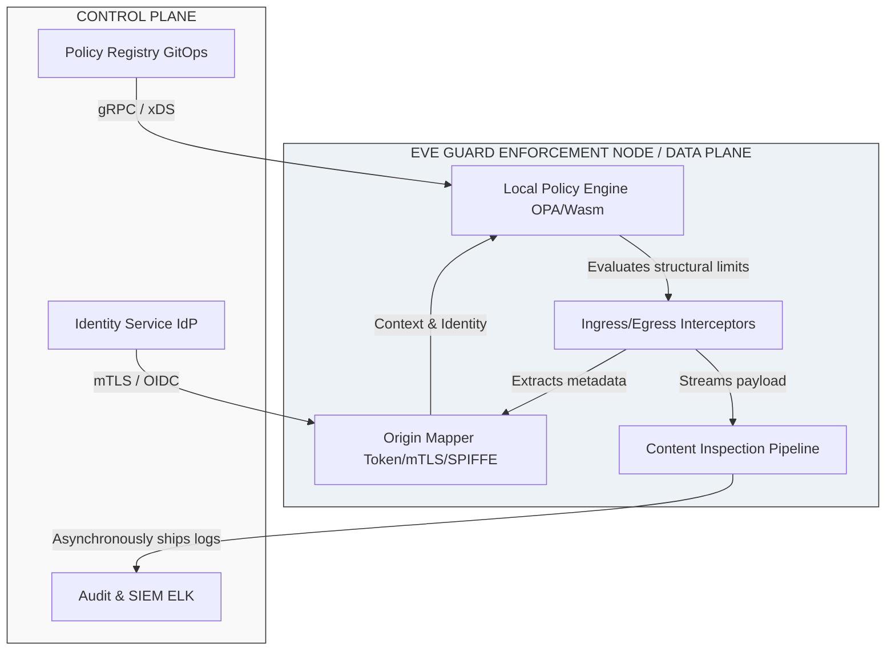
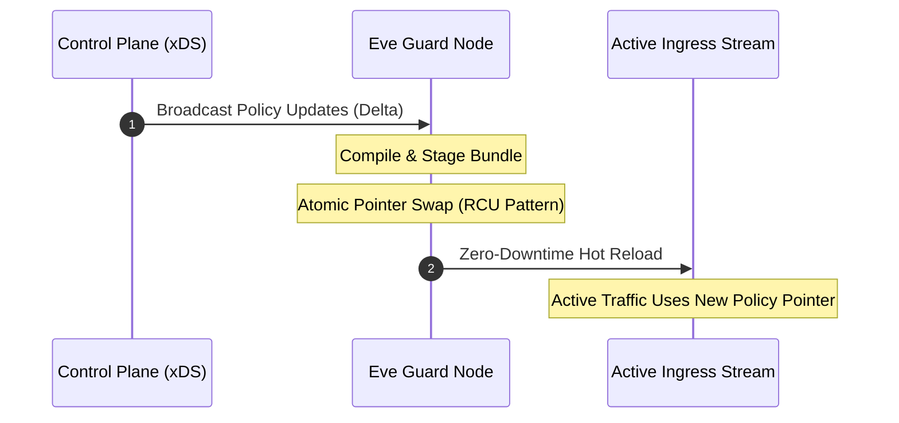
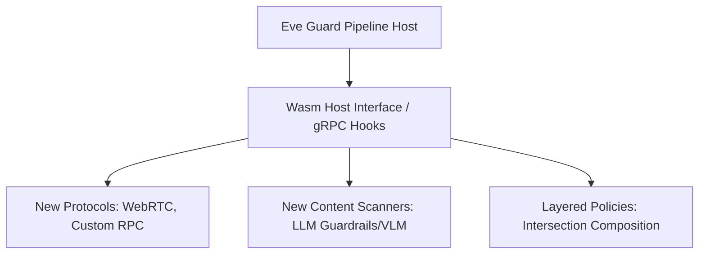

# EVE Architecture Proposal

## **1\. Architecture**

Eve Guard is designed as a distributed, low-latency enforcement plane (Data Plane) that intercepts all incoming and outgoing traffic for AI agents, tools, and traditional applications. It separates the orchestration and storage of policies (Control Plane) from the execution of those policies (Data Plane).



### **Core Components**

* **Ingress/Egress Interceptors:** Reverse proxies or sidecars (built on Envoy or custom Rust-based proxies) that sit directly in the network path.  
* **Origin Mapper:** Extracts cryptographic metadata from the connection or application layer to establish the precise origin profile.  
* **Local Policy Engine:** An embedded, high-performance evaluation engine (e.g., Open Policy Agent (OPA) compiled to WebAssembly or a custom Rego runner) that evaluates policy rules against structured context locally.  
* **Content Inspection Pipeline:** A streaming asynchronous/synchronous evaluation channel specialized in parsing payloads, scanning for secrets, and verifying structured data.

### **Interaction over Paths**

#### **MCP Traffic Path**

The Model Context Protocol (MCP) typically runs over JSON-RPC via SSE (Server-Sent Events) or standard stdio pipes. Eve Guard operates as an intermediate **MCP Proxy**.  
When an AI Agent requests a tool execution or sends a prompt to a LLM via MCP:

1. The interceptor decodes the JSON-RPC frame (tools/call, resources/read, prompts/get).  
2. It pauses the stream, extracts the origin from the transport-level channel identity, and submits the structural metadata to the Local Policy Engine.  
3. Upon approval, the payload passes to the target. Responses follow the inverse path, passing through the Content Inspection Pipeline before returning to the agent.

#### **API Calls Path (HTTP/gRPC)**

For standard REST or gRPC APIs, Eve Guard deploys as an API Gateway or a sidecar proxy. It acts as a terminating or mutating proxy that extracts HTTP headers or gRPC metadata, performs access verification, and forwards the packet.

#### **Origin Identification**

Origin identification does not rely on easily forged application headers. It uses:

* **mTLS / SPIFFE IDs:** Every service, tool, or autonomous agent runner is issued a short-lived X.509 certificate via SPIFFE/SPIRE. The SAN (Subject Alternative Name) encodes the precise identity (e.g., spiffe://eve.internal/ns/prod/sa/agent-alpha).  
* **Signed Claims (JWT):** Applications interacting over HTTP must supply an identity token signed by the Eve Identity Service, pinning the origin.

#### **Integration with the Eve Platform**

* **Policy Registry:** The Registry pushes policy bundles using the xDS protocol or secure polling via gRPC. Eve Guard nodes compile these rules into internal memory states.  
* **Identity Service:** Periodically validates public key infrastructures (PKI) or caches token verification keys locally to prevent per-request remote authentication lookups.  
* **Logging/Audit:** Every evaluation generates a structured JSON log asynchronously shipped via a zero-copy ring buffer to the Eve Audit tier.

## **2\. Policy Association & Evaluation Flow**

### **Policy Retrieval and Lifecycle**

Eve Guard does not look up policies on a per-request basis. Instead, it maintains a unified, hot-swappable local lookup table where the key is the validated **Origin Identifier** and the value is a **compiled Policy Bundle Pointer**.



* **Caching Strategy:** Mappings are held entirely in-memory using an optimized concurrent map structure (e.g., lock-free sharded caches).  
* **Refresh Strategy:** The Control Plane utilizes gRPC streaming (similar to Envoy's xDS configuration API) to broadcast changes instantly. When a policy changes in the registry, the control plane calculates affected origins and pushes delta updates.  
* **Dynamic Assignment Changes:** If an agent's assigned policy changes, Eve Guard invalidates the specific map entry and points it to the new compiled schema atomically. Traffic processing is unaffected due to a hazard-pointer or read-copy-update (RCU) pattern.

### **Evaluation Sequence**

1. **Extract:** Incoming frame intercepted $\rightarrow$ Origin resolved to agent-omega.  
2. **Fetch Bundle:** Look up agent-omega in the local policy map. If missing, fall back to a default "zero-trust" baseline policy.  
3. **Construct Context:** Build an evaluation context object containing request parameters, destination, and payload schemas.  
4. **Execute Local Rule:** Run the data through the Local Policy Engine. The evaluation must complete under deterministic time bounds (typically $<2\text{ ms}$).

## **3\. Real-Time Enforcement**

### **Interception & Context Assembly**

Interception occurs natively within the network kernel or data stream using eBPF or high-performance proxy hooks.  
The evaluation context is assembled into a single structured object:

```JSON  
{  
  "origin": {  
    "id": "spiffe://eve.internal/agent-04",  
    "tier": "untrusted-external",  
    "tenant\_id": "tenant-99"  
  },  
  "request": {  
    "protocol": "MCP",  
    "method": "tools/call",  
    "target\_tool": "database\_writer",  
    "arguments": { "query": "DROP TABLE transactions;" }  
  },  
  "environment": {  
    "timestamp": 1782982400  
  }  
}
```

### **Response Content & Data-Level Policy Enforcement**

Enforcement on responses requires content transformation and state evaluation.

* **No PII / Secrets in Model Responses:** Responses pass through a localized Content Inspection Pipeline. It utilizes high-throughput vectorized regex matching paired with a local instance of Microsoft Presidio or specialized high-speed tokenizers to flag patterns matching Social Security Numbers, Credit Cards, or Cloud Provider API keys.  
* **Remediation Actions:** Depending on the rule attached to the origin policy, Eve Guard executes one of three actions:  
  * **Redact:** Replaces the sensitive segment with \[REDACTED\_PII\_IP\].  
  * **Block:** Short-circuits the response entirely, returning an MCP error or HTTP 403 Forbidden.  
  * **Encrypt:** Transforms the string into an encrypted cipher token decipherable only by authorized downstream clients.  
* **Privilege-Based Output Rules:** Lower-privilege agents are subjected to strict output formatting policies (e.g., outputs must strictly conform to a static JSON schema). If the model hallucinates or outputs markdown instead of JSON, Eve Guard strips the malformed data and forces an execution exception.

## **4\. Scalability & Performance**

To guarantee sub-millisecond overhead and infinite horizontal scalability, Eve Guard enforces strict data locality guidelines.

| Feature | Design Implementation | Performance Impact |
| :---- | :---- | :---- |
| **Local vs Remote Decisions** | **100% Local Execution**. All policy binaries, definitions, and origin maps reside inside the process memory space of the Eve Guard node. No external network hops are made during the request lifecycle. | Reduces evaluation latency to $< 3\text{ ms}$ vs $50\text{-}100\text{ ms}$ for remote checks. |
| **Horizontal Scaling** | Nodes deploy as stateless replica sets across Kubernetes clusters or edge regions. Since state is pushed down via the Control Plane, nodes do not coordinate with each other. | Linear scaling capacity ($O(1)$ coordination cost). |
| **Zero-Copy Architecture** | Memory allocations are minimized using sliding window text references over raw transport buffers during regex/PII scans. | Reduces memory footprint and CPU utilization under heavy streaming traffic. |

## **5\. Resiliency & Failure Modes**

Eve Guard divides its failure domains systematically to ensure that security compromises cannot happen during infrastructure turbulence.

### **Fail-Open vs. Fail-Closed Matrix**

| Failure State | Policy Class / Sensitivity | Default Behavior | Justification |
| :---- | :---- | :---- | :---- |
| Control Plane Unreachable | All Classes | **Fail Safe (Keep Last State)** | Nodes retain their current in-memory cache indefinitely and continue enforcing using the latest known valid configurations. |
| In-Memory Cache Corrupted | High-Security Tier (e.g., Financial / Admin Tools) | **Fail-Closed** | Rejects all incoming traffic with an internal security error code until the node state is re-initialized. |
| In-Memory Cache Corrupted | Low-Security / Public Read-Only Tier | **Fail-Open** | Allows standard operations but logs a critical system health alert to fallback collectors. |
| Content Pipeline Timeout | PII / Secret Scanning Rules | **Fail-Closed** | If a response payload stalls the inspection engine beyond its $20\\text{-}100\\text{ ms}$ SLA, the payload is blocked to prevent data exfiltration. |

### **Degradation Mitigation**

* **Circuit Breaking:** If the pipeline becomes overloaded, Eve Guard throttles non-essential agents while keeping critical enforcement lanes clear.  
* **Stale Configurations:** If a node detects it has been disconnected from the control plane for longer than a predefined Time-To-Live (e.g., 5 minutes), it marks its local policy cache as "stale" and transitions high-risk origins to a highly restricted fallback policy.

## **6\. Security Considerations**

### **Threat Modeling & Mitigations**

* **Forged Origins:** Attackers might try injecting headers like X-Eve-Origin: admin-agent.  
  * *Mitigation:* Eve Guard strips out all inbound identity headers at the boundary proxy and overwrites them using structural, unforgeable network properties derived from mTLS handshakes.  
* **Compromised Agent:** An approved agent turns malicious and attempts prompt injection or unauthorized tool execution.  
  * *Mitigation:* Dynamic behavioral validation rules embedded within the origin's policy bundle flag anomalous query frequencies or structural variance.  
* **Misconfigured Policy:** An operator uploads a broken or permissive policy bundle.  
  * *Mitigation:* The Control Plane enforces a dry-run structural validation step during deployment. All policies must pass static analysis before being broadcasted to the data plane.

### **Debugging & Observability**

* **Tamper-Resistant Traces:** Logs are cryptographically signed at the point of origin using the node's private key before being offloaded via a write-once pipeline, preventing malicious actors from erasing footprints.  
* **Simulated Testing (Dry Run Mode):** Operators can evaluate policies using a specific header flag (X-Eve-Guard-Mode: Shadow). The node processes the traffic, computes the decision against the current policy, and records if it *would* have blocked the action, without disrupting production workloads.

## **7\. Extensibility**

Eve Guard utilizes a modular, engine-agnostic plugin framework to handle evolving security landscapes.



* **New MCP Tools / Interceptors:** Interceptors are decoupled from evaluation modules. Adding support for a new MCP format requires writing an isolated protocol decoding module that converts incoming streams into standard context formats.  
* **New Content Detection Classes:** Advanced detectors (e.g., vector embeddings scanners for intellectual property protection) can be compiled into WebAssembly binaries and hot-plugged into the Content Inspection Pipeline without recompiling the main binary.  
* **Layered Policies:** Policy bundles support a nested inheritance model. Eve Guard resolves this at evaluation time using a composition order:  
  $$\text{Final Decision} = \text{Global Policy} \cap \text{Tenant Policy} \cap \text{Origin Policy}$$

## **8\. Critical Tradeoffs**

An objective evaluation highlights structural compromises made within this architectural framework:

1. **Memory Overhead vs. Decoupled Lookup Latency:** Holding all origin maps and policy definitions entirely in the RAM of every local node drastically improves latency ($<3\text{ ms}$). However, in massive multi-tenant microservices clusters with millions of distinct origin profiles, this strategy consumes significant system memory.  
2. **Streaming Throughput vs. Depth of Inspection:** Running complex regular expressions, tokenizers, or small AI guardrail models on real-time streaming output text guarantees clean data delivery, but introduces processing friction. It trade-offs max streaming bandwidth for deterministic data leak safety.  
3. **Strict Isolation vs. Contextual Loss:** By treating each origin independently and decoupled from general runtime states, Eve Guard blocks horizontal privilege escalation perfectly. However, it cannot inherently detect multi-agent collusion unless an external aggregate state-tracking engine is added to the architecture.

### **References**

* [Model Context Protocol (MCP) Specification](https://modelcontextprotocol.io)  
* [Open Policy Agent (OPA) Documentation & Architecture](https://www.openpolicyagent.org/docs/latest/)  
* [SPIFFE Production Identity Framework for Enterprise](https://spiffe.io)

Note: This document was built with help of Gemini.